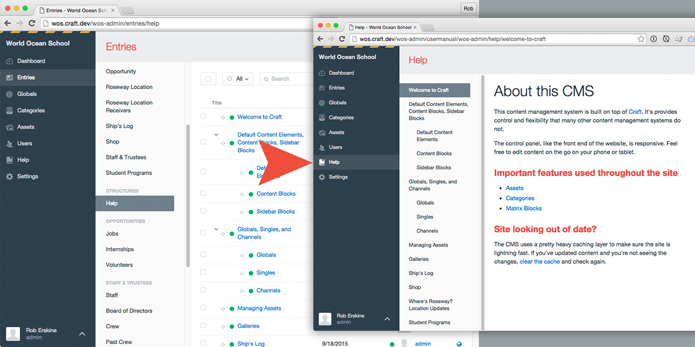

# Craft User Manual plugin for Craft CMS 4.x and Craft CMS 5.x

Craft User Manual allows developers (or even content editors) to provide CMS documentation using Craft's built-in sections (singles, channels, or structures) to create a "User Manual" or "Help" section directly in the control panel.

## Requirements

This plugin requires Craft CMS 4.0.0 or later.

## Installation

### Craft 4 and Craft 5
To install the plugin in your Craft 4 project, follow these instructions.

1. Open your terminal and go to your Craft project:

        cd /path/to/project

2. Then tell Composer to load the plugin:

        composer require hillholliday/craft-user-manual

> Wondering why it says `hillholliday` and not `roberskine` as the org? This package was originally submitted as hillholliday, and to [preserve the artifacts on Packagist](https://packagist.org/packages/hillholliday/craft-user-manual) we have kept it as hillholliday.

3. In the Control Panel, go to Settings → Plugins and click the “Install” button for usermanual.

4. Select the section the plugin should use as the **User Manual** page in the CP.
    * (Optional) - Replace the plugin's name to something your user's will understand.
    * (Optional) - Use more than the default `body` fieldhandle by setting up custom template overrides.

5. Click the **User Manual** link in the CP nav.

### Craft 3
To install the plugin in your Craft 3 project, follow these instructions.

1. Open your terminal and go to your Craft project:

        cd /path/to/project

2. Then tell Composer to load the plugin:

        composer require hillholliday/craft-user-manual:2.1.2

3. In the Control Panel, go to Settings → Plugins and click the “Install” button for usermanual.

4. Select the section the plugin should use as the **User Manual** page in the CP.
    * (Optional) - Replace the plugin's name to something your user's will understand.
    * (Optional) - Use more than the default `body` fieldhandle by setting up custom template overrides.

5. Click the **User Manual** link in the CP nav.
## Configuration

* All settings may be optionally configured using a [config file](https://craftcms.com/docs/5.x/extend/plugin-settings.html#overriding-setting-values). The values, contained in [`config.php`](https://github.com/roberskine/Craft-User-Manual/blob/master/src/config.php), are described below:

### pluginNameOverride
Intuitive, human-readable plugin name for the end user.

### templateOverride
For more control over the output, you may optionally override the default template.

Path is relative to ../craft/templates/.

### section
Entries in this section must have associated urls. When this value is set from the `usermanua.php` file, it much use the section ID as the value, not the section handle.

### enabledSideBar
Enables the sidebar on the manual page

Defaults to true.

## Some notes
* The plugin currently only pulls in the `body` field from each entry in the selected section, unless you're using a template override.
* While the **User Manual** section works best with `Structures`, you can certainly get away with using a one-off `Single`.
* If you're running _Craft Client_ or _Craft Pro_ make sure your content editors don't have permission to edit whatever section you've selected to use as your **User Manual**
* Only sections with entry URLs may be used as your **User Manual** section.

## Thanks
This plugin was inspired by the team over at [70kft](http://70kft.com/) for their work on [Craft-Help](https://github.com/70kft/craft-help). While their plugin is definitely more flexible in terms of writing custom markdown in separate files, we wanted to create something that would make it easier for anyone to edit documentation without making any changes to the server. This works particularly well for larger projects where more than one person (especially non-devs) are writing documentation for how to use the CMS.

## Releases
* **5.0.1** - Required "section" config setting to be an integer. Added "enabledSideBar" config setting to enable/disable the sidebar on the manual page. This fix is to help address possible issue in Craft 4 to Craft 5 migration.
* **5.0.0** - Craft 5 support! Thanks to [John Morton](https://github.com/johnfmorton) and [Dalton Rooney](daltonrooney) for your contributions.
* **4.0.0** - Craft 4 support! Thanks to [Chris DuCharme](https://github.com/Chris-DuCharme) for migrating up to Craft 4.
* **2.1.0** - Merging PRs from [JorgeAnzola](https://github.com/JorgeAnzola) and [sameerast](https://github.com/sameerast)
* **2.0.3** - Forcing updating to plugin store
* **2.0.2** - Merging in [@aaronbushnell](https://github.com/aaronbushnell)'s [fix for incorrect reference to asset bundle](https://github.com/roberskine/Craft-User-Manual/pull/17).
* **2.0.1** - Merging in [@mgburns](https://github.com/mgburns)' [fix for Craft 3 deprecation warnings](https://github.com/roberskine/Craft-User-Manual/pull/11).
* **2.0.0** - Merging in [@jcdarwin](https://github.com/jcdarwin) Craft 3 port. [Craft 3 version of Craft User Manual](https://github.com/roberskine/Craft-User-Manual/pull/8).
* **1.1.1** - Adding in RTL language support.
* **1.1.0** - Merging in [@timkelty](https://github.com/timkelty)'s work which [includes template overrides, updated error prompts, and other misc improvements](https://github.com/roberskine/Craft-User-Manual/pull/3).
* **1.0.1** - Adding support for plugin custom icons in Craft 2.5.
* **1.0.0** - Initital release of Craft User Manual.

We hope this plugin is useful, and we'd love to hear any suggestions or issues you may have. [@erskinerob](https://twitter.com/erskinerob).

Brought to you by [Rob Erskine](https://twitter.com/erskinerob).
