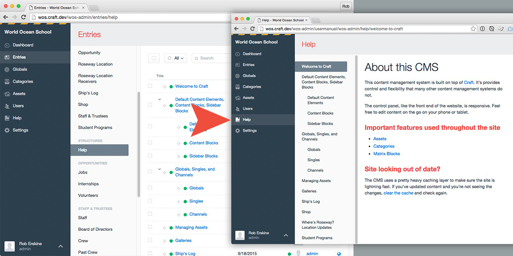

# Craft User Manual plugin for Craft CMS 4.x and Craft CMS 5.x

[](https://github.com/RobErskine/Craft-User-Manual/actions/workflows/ci.yml)

Craft User Manual allows developers (or even content editors) to provide CMS documentation using Craft's built-in sections (singles, channels, or structures) to create a "User Manual" or "Help" section directly in the control panel.



## Requirements

This plugin requires Craft CMS 4.0.0 or later; or Craft CMS 5.0.0 or later.

## Installation

### Craft 4 and Craft 5
To install the plugin in your Craft 4 or Craft 5 project, follow these instructions.

1. Open your terminal and go to your Craft project:

        cd /path/to/project

2. Then tell Composer to load the plugin:

        composer require hillholliday/craft-user-manual

> Wondering why it says `hillholliday` and not `roberskine` as the org? This package was originally submitted as hillholliday, and to [preserve the artifacts on Packagist](https://packagist.org/packages/hillholliday/craft-user-manual) we have kept it as hillholliday.

3. In the Control Panel, go to Settings → Plugins and click the “Install” button for usermanual.

4. Select the section the plugin should use as the **User Manual** page in the CP.
    * (Optional) - Replace the plugin's name to something your user's will understand.
    * (Optional) - Use more than the default `body` fieldhandle by setting up custom template overrides.

5. Click the **User Manual** link in the CP nav.

### Craft 3
To install the plugin in your Craft 3 project, follow these instructions.

1. Open your terminal and go to your Craft project:

        cd /path/to/project

2. Then tell Composer to load the plugin:

        composer require hillholliday/craft-user-manual:2.1.2

3. In the Control Panel, go to Settings → Plugins and click the “Install” button for usermanual.

4. Select the section the plugin should use as the **User Manual** page in the CP.
    * (Optional) - Replace the plugin's name to something your user's will understand.
    * (Optional) - Use more than the default `body` fieldhandle by setting up custom template overrides.

5. Click the **User Manual** link in the CP nav.
## Configuration

* All settings may be optionally configured using a [config file](https://craftcms.com/docs/5.x/extend/plugin-settings.html#overriding-setting-values). The values, contained in [`config.php`](https://github.com/roberskine/Craft-User-Manual/blob/master/src/config.php), are described below:

<a id="config-settings-pluginNameOverride"></a>
### pluginNameOverride
Intuitive, human-readable plugin name for the end user.

<a id="config-settings-templateOverride"></a>
### templateOverride
For more control over the output, you may optionally override the default template.

Path is relative to ../craft/templates/.

<a id="config-settings-section"></a>
### section
Entries in this section must have associated urls. When this value is set from the `usermanua.php` file, it much use the section ID as the value, not the section handle.

### enabledSideBar
Enables the sidebar on the manual page

Defaults to true.

<a id="config-settings-managedFolder"></a>
### managedFolder
_(since 5.1.0)_ Filesystem path to a folder of `.md` files that the `usermanual/sync` command imports into the section. Alias-aware (e.g. `'@root/help-manual'`). Leave `null` to disable the sync. See [Markdown sync](#markdown-sync-git--cp) below.

<a id="config-settings-readOnlyManaged"></a>
### readOnlyManaged
_(since 5.1.0)_ When `true`, section entries that are backed by a markdown file in `managedFolder` become **read-only in the CP** — the markdown is the source of truth. Entries with no backing file stay editable. The sync command bypasses this guard while it runs. Defaults to `false`.

<a id="config-settings-bodyField"></a>
### bodyField
_(since 5.1.0)_ Handle of the field that stores the markdown body on the section's entries. Defaults to `body`. Set this when you use a `templateOverride` that reads a different field (e.g. `helpContent`).

## Markdown sync (git → CP)

_(since 5.1.0)_ Instead of (or in addition to) editing manual pages in the control panel, you can keep them as version-controlled markdown and push them into the CP with a console command. This keeps documentation diffable, reviewable, and easy to maintain across multiple sites.

1. Point `managedFolder` at a folder of `.md` files (in `config/usermanual.php`):

   ```php
   return [
       'section'         => 'secHelp',        // your manual section
       'managedFolder'   => '@root/help-manual',
       'bodyField'       => 'helpContent',    // if not the default `body`
       'readOnlyManaged' => true,             // optional: lock CP editing of synced pages
   ];
   ```

2. Author each page as a `.md` file with optional YAML frontmatter:

   ```markdown
   ---
   title: Getting Started
   slug: getting-started      # optional; defaults to the filename (minus an "NN-" order prefix)
   parent: craft-cms          # optional; slug of the parent page (structure sections)
   order: 10                  # optional; sort hint, used only when first creating the page
   enabled: true              # optional; default true
   delete: false              # optional; true soft-deletes the page with this slug
   ---
   # Getting Started

   Markdown body…
   ```

3. Run the sync (e.g. on deploy, on cron, or by hand):

   ```bash
   craft usermanual/sync            # import managedFolder/*.md
   craft usermanual/sync --dry-run  # report what would change, write nothing
   ```

The sync is **one-way** (git → DB) and **idempotent** — it only saves a page when its title, body, or enabled state actually changed, and it never touches section entries that have no backing file (so a CP-maintained page can live alongside the managed ones). Removals are declarative: ship a file with `delete: true` to retire an obsolete page.

> **Note:** the sync writes through Craft's element API, so the target section's entry type needs an editable **Title** field — entry types that auto-generate their title (via a Title Format) won't have their titles updated by the sync.

## Some notes
* The plugin currently only pulls in the `body` field from each entry in the selected section, unless you're using a template override.
* While the **User Manual** section works best with `Structures`, you can certainly get away with using a one-off `Single`.
* If you're running _Craft Client_ or _Craft Pro_ make sure your content editors don't have permission to edit whatever section you've selected to use as your **User Manual**
* Only sections with entry URLs may be used as your **User Manual** section.

## Thanks
This plugin was inspired by the team over at [70kft](http://70kft.com/) for their work on [Craft-Help](https://github.com/70kft/craft-help). While their plugin is definitely more flexible in terms of writing custom markdown in separate files, we wanted to create something that would make it easier for anyone to edit documentation without making any changes to the server. This works particularly well for larger projects where more than one person (especially non-devs) are writing documentation for how to use the CMS.

## Releases

See [CHANGELOG.md](CHANGELOG.md) for full release history.

We hope this plugin is useful, and we'd love to hear any suggestions or issues you may have. [@erskinerob](https://twitter.com/erskinerob).

Brought to you by [Rob Erskine](https://twitter.com/erskinerob).
